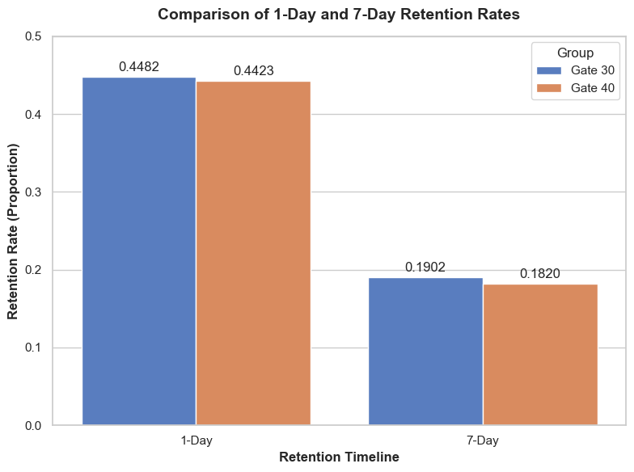

# Mobile Games A/B Testing: Cookie Cats Retention Optimization

## 📌 Project Overview
This project analyzes an A/B test experiment from the popular mobile puzzle game, **Cookie Cats**. The goal is to evaluate the impact of moving the first in-game progress gate from **Level 30** (Control Group) to **Level 40** (Treatment Group) on player retention and overall game rounds played.

## 📊 Dataset Description
The dataset was sourced from Kaggle and contains data from **90,189 players** who installed the game during the experiment.
- `userid`: A unique number that identifies each player.
- `version`: Whether the player was put in the control group (`gate_30`) or the test group (`gate_40`).
- `sum_gamerounds`: The number of game rounds played by the player during the first 14 days after installation.
- `retention_1`: Did the player come back and play 1 day after installing?
- `retention_7`: Did the player come back and play 7 days after installing?

## 🛠️ Data Cleaning & Outlier Management
During the Exploratory Data Analysis (EDA), an extreme outlier was detected where a single player recorded **49,854 game rounds** within 14 days. 
- **Action Taken:** This anomalous row was successfully removed to protect the integrity of the statistical metrics, which drastically improved the data variance (Standard Deviation dropped from 195 to 102).

## 🔬 Statistical Methodology
Since the retention metrics (`retention_1` and `retention_7`) are **binary categorical variables**, a **Chi-Square Test of Independence ($\chi^2$)** was conducted at a significance level of $\alpha = 0.05$ to determine if the differences between groups were statistically significant.

## 📈 Key Findings & Results

### 1. 1-Day Retention Rate
- **Gate 30 (Control):** 44.82% | **Gate 40 (Treatment):** 44.23%
- **Statistical Significance:** $P\text{-value} = 0.0750$
- **Inference:** The slight drop is **not statistically significant**. The change did not heavily impact immediate next-day engagement.

### 2. 7-Day Retention Rate
- **Gate 30 (Control):** 19.02% | **Gate 40 (Treatment):** 18.20%
- **Statistical Significance:** $P\text{-value} = 0.0016$ ($P < 0.01$)
- **Inference:** The drop is **highly statistically significant**. Forcing the gate later (at Level 40) systematically harms long-term player retention.

## 🎯 Business Insights & Recommendation
- **The Burnout Effect:** Forcing players to encounter a gate earlier (Level 30) acts as a calculated "forced break", which spikes psychological anticipation, prevents early game burnout, and boosts long-term engagement.
- **Final Recommendation:** **DO NOT** move the gate to level 40. Keep the gate at **Level 30** to sustain the highest possible long-term player retention and game monetization.

## 💻 Tech Stack & Libraries Used
- **Language:** Python
- **Data Manipulation:** Pandas, NumPy
- **Statistical Analysis:** Scipy.stats (Chi-Square Contingency)
- **Data Visualization:** Matplotlib, Seaborn

